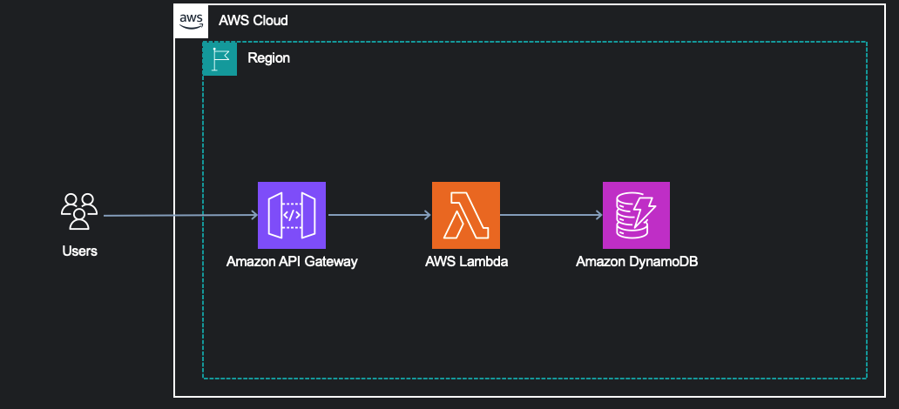

# Write a README for this NextJS project

## Architecture

## Tech Stack
- Auth0
- API Gateway
- DynamoDB
- NextJS

## How to run this project
1. Clone this repository
2. Create .env.local file and add the credentials
3. Run `npm install`
4. Run `npm run dev`